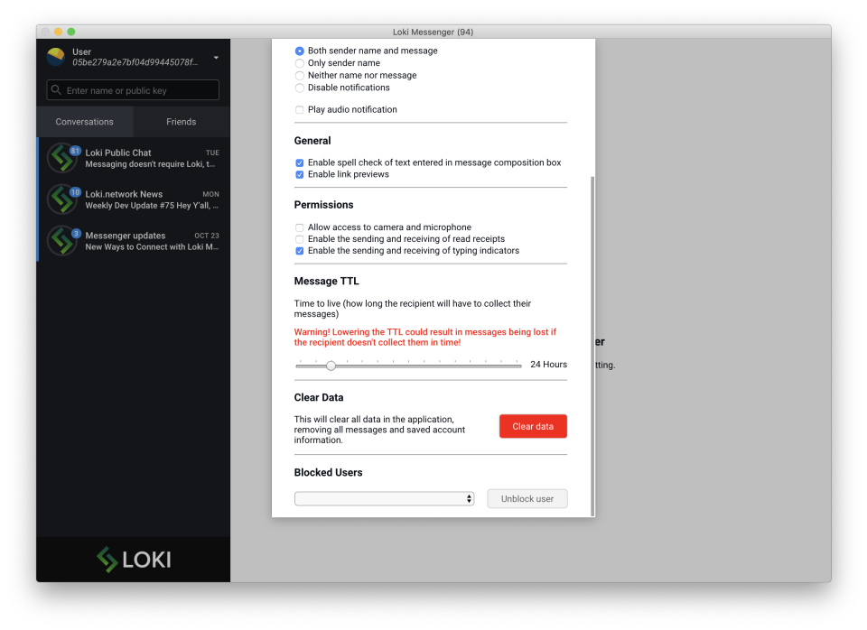
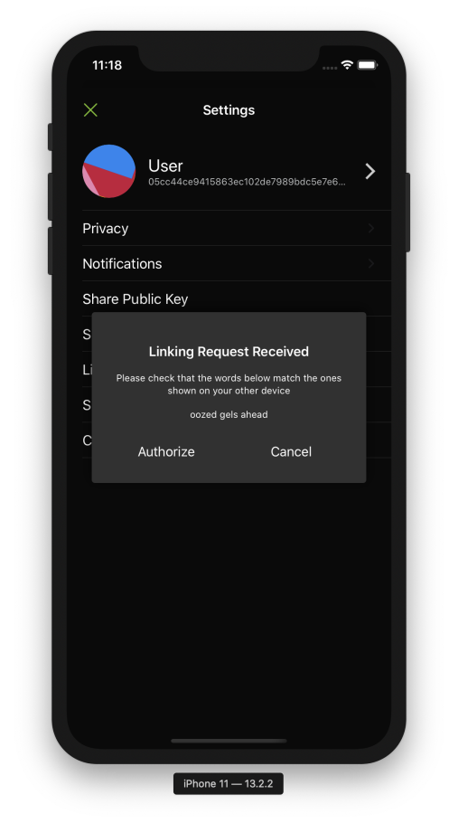

title: Loki Docs | Multi-Device Support for Loki Messenger | Decentralised Messenger
description: Loki Messenger now features cross-platform multidevice support, allowing you to use the same private key across your devices while maintaining security and privacy.

# Loki Messenger Multi-Device Setup

Loki Messenger now features cross-platform multidevice support, allowing you to use the same private key across your devices while maintaining security and privacy. Multidevice support is currently in early alpha, and the setup process is less streamlined than it will be when the feature moves out of alpha. The steps outlined in this guide will help you avoid data loss or other adverse effects when setting up multidevice for your Loki Messenger.

## Primary and Secondary Device
Currently the Loki Messenger only supports two devices per account; A primary and secondary device. This is only a temporary limitation and in the future more than two devices will be able to be connected to the same account.

## Requirements:
- Primary Device; A Device with Loki Messenger downloaded, installed and initiated.
- Primary Public Key; The public key from your primary device generated by the Loki Messenger.
- Secondary Device; A device with the Loki Messenger installed but not initialised to a key.

## Preperation

If you have Loki Messenger installed on both devices and they both have their own public keys we will need to delete one to become our secondary device.

### Mobile as a secondary device.

If you want your mobile messenger as your secondary device and it already has it's own public key then delete the application and redownload it from the apple store or play store.

### Desktop as secondary device.
If you want your desktop messenger as your secondary device and it already has it's own public key then go to `File` > `Preferences` > `Clear Data`.

## Setup

For this demonstration we are going to have our mobile device as our primary device and the desktop as our secondary.

### Step 1: Get public address from primary device.

On your mobile messenger go into settings by clicking on your profile icon and copy your public key. 

We will need to send this public key to the device that will be our secondary device.

### Step 2: Paste public key into secondary device.

> WARNING: DO NOT JUMP THROUGH THIS STEP. If you click the `Link` button on your secondary device before the primary device is ready and waiting you may lose the chance to sync the devices.

Our messenger on desktop should not have an account installed on it yet. If you already have an account on your desktop messenger go to [Desktop as a secondary device](#desktop-as-secondary-device) step and clear your data.

Upon opening the Loki Messenger Desktop client we will be prompted with 3 options:

- Register a new account

- Restore using seed

- Link device to an existing account.

Click option `Link device to an existing account` and paste your public key copied in [step 1](#step-1-get-public-address-from-primary-device). 

> DO NOT CLICK THE **LINK** BUTTON YET. We need to prepare our primary device first.

### Step 3: Prepare primary device.

To prepare the primary device we need to go back into our settings menu and click the `Link Device` button.

Once the button has been clicked the messenger will show a new popup saying "Waiting for Device".

### Step 4: Click `Link` button on secondary device.

Now we can click the `Link` button on our desktop messenger.

### Step 5: Authorise connection on your primary device.

Once we have clicked `Link` on our secondary device, we will be prompted on our primary device to authorise the link request. Check the 3 words match between devices and authorise the request.

## Congratulations! 
### You have setup a multi-device account on Loki Messenger.